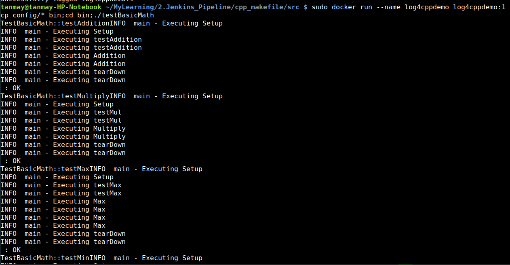

# Unit Testing and Logging for C++ Application

This is a sample Calclator C++ Program to demonstrate the use of Libraries CPPUnit and Log4CXX.

## CPPUnit
* The CppUnit is the C++ port of the famous JUnit framework for unit testing.
* More Details on CPPUnit is at : https://sourceforge.net/projects/cppunit/

## Log4CXX
* Apache log4cxx is a logging framework for C++ patterned after Apache log4j, which uses Apache Portable Runtime for most platform-specific code and should be usable on any platform supported by APR.
* More Details at : https://logging.apache.org/log4cxx/latest_stable/

## Libraries Versions

* liblog4cxx10-dev
* libcppunit-dev

## Running the Code
Since the version of libraries differ from OS version to Version, I have created a docker container with the required library versions.

* Build the docker container using the below command.
`sudo docker build -t log4cppdemo:1 .`

* Run the container
`sudo docker run --name log4cppdemo log4cppdemo:1`

Output:

